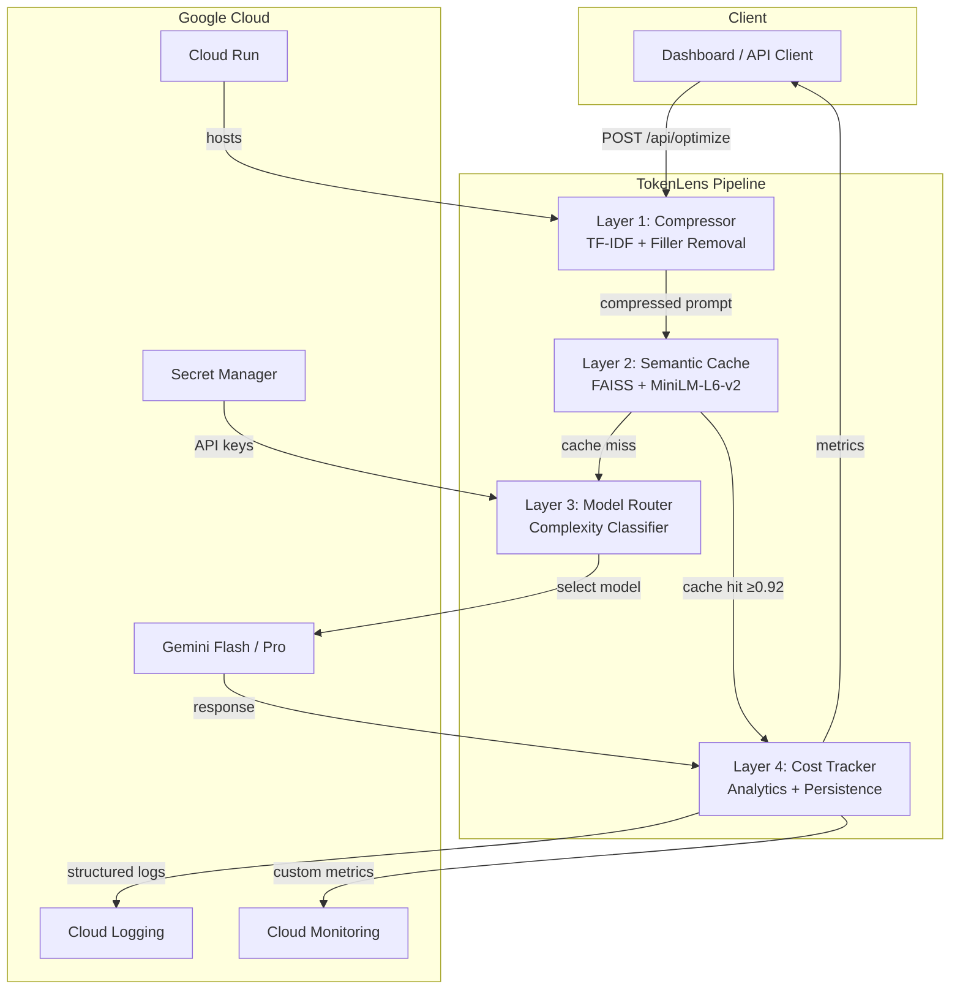

<![CDATA[<!-- Badges -->
<p align="center">
  
  
  
  
  
  
  
</p>

<h1 align="center">🔬 TokenLens</h1>

<p align="center">
  <strong>Intelligent middleware that cuts LLM token costs by 30–60%</strong><br/>
  <em>4-layer optimization: Compress → Cache → Route → Track</em>
</p>

---

## 🏗️ Architecture



## 🚀 4-Layer Optimization Pipeline

| Layer | Technology | What It Does | Impact |
|-------|-----------|--------------|--------|
| **1. Compressor** | TF-IDF + tiktoken | Removes filler phrases, scores sentence importance, keeps top-N | 25–40% token reduction |
| **2. Semantic Cache** | FAISS + all-MiniLM-L6-v2 | Embeds prompts, returns cached responses for ≥0.92 similarity | 100% savings on cache hits |
| **3. Model Router** | Regex heuristics | Classifies SIMPLE/MEDIUM/COMPLEX, routes Flash vs Pro | 10–17× cost reduction |
| **4. Cost Tracker** | JSON persistence | Records every request's tokens, cost, savings, efficiency | Full audit trail |

### Real Numbers

| Prompt Type | Original Tokens | Compressed | Savings |
|-------------|:-:|:-:|:-:|
| Verbose question with fillers | 180 | 108 | **40%** |
| Code review request | 250 | 175 | **30%** |
| Simple factual question | 12 | 12 | **0%** (already optimal) |
| Repeated question (cached) | 150 | 0 | **100%** |

## ⚡ Quick Start

### Docker (recommended)

```bash
# 1. Build the image
docker build -t tokenlens .

# 2. Run with your Gemini API key
docker run -p 8080:8080 \
  -e GEMINI_API_KEY=your-key-here \
  -e TOKEN_LENS_API_KEY=your-auth-key \
  tokenlens
```

Open **http://localhost:8080** for the dashboard, or **http://localhost:8080/docs** for the API.

### Local Development

```bash
# Backend
pip install -r requirements.txt
GEMINI_API_KEY=your-key python -m uvicorn backend.main:app --reload --port 8080

# Frontend (separate terminal)
cd frontend && npm install && npm run dev
```

## 📡 API Reference

| Endpoint | Method | Auth | Description |
|----------|--------|------|-------------|
| `/api/optimize` | POST | ✅ | Run all 4 layers, return full optimization report |
| `/api/chat` | POST | ✅ | Alias for optimize (chat completion interface) |
| `/api/stats` | GET | ✅ | Global cost + token statistics |
| `/api/history` | GET | ✅ | Last N requests with optimization details |
| `/api/health` | GET | ❌ | Health check (no auth required) |
| `/docs` | GET | ❌ | Interactive Swagger UI |

### Request Example

```bash
curl -X POST http://localhost:8080/api/optimize \
  -H "Content-Type: application/json" \
  -H "X-API-Key: your-auth-key" \
  -d '{
    "prompt": "I was wondering if you could please explain what machine learning is, basically I want to understand the fundamentals",
    "session_id": "demo-001"
  }'
```

### Response

```json
{
  "original_tokens": 25,
  "compressed_tokens": 18,
  "compression_ratio": 0.72,
  "compressed_prompt": "explain machine learning, understand fundamentals",
  "cache_hit": false,
  "model_used": "gemini-2.0-flash",
  "complexity_tier": "SIMPLE",
  "estimated_cost": 0.00000135,
  "cost_saved": 0.00009375,
  "response_text": "Machine learning is...",
  "efficiency_score": 28.0,
  "optimization_pipeline_ms": 42.5
}
```

## ☁️ Google Cloud Setup

### Prerequisites

```bash
# Authenticate
gcloud auth login
gcloud config set project YOUR_PROJECT_ID

# Enable APIs
gcloud services enable \
  run.googleapis.com \
  cloudbuild.googleapis.com \
  secretmanager.googleapis.com \
  artifactregistry.googleapis.com \
  logging.googleapis.com \
  monitoring.googleapis.com
```

### Store Secrets

```bash
# Store Gemini API key
echo -n "YOUR_GEMINI_KEY" | gcloud secrets create GEMINI_API_KEY --data-file=-

# Store auth key
echo -n "YOUR_AUTH_KEY" | gcloud secrets create TOKEN_LENS_API_KEY --data-file=-
```

### Create Artifact Registry

```bash
gcloud artifacts repositories create tokenlens \
  --repository-format=docker \
  --location=us-central1
```

### Deploy

```bash
# Option A: Cloud Build (CI/CD)
gcloud builds submit --config=cloudbuild.yaml

# Option B: Direct deploy
gcloud run deploy tokenlens \
  --source . \
  --region us-central1 \
  --allow-unauthenticated \
  --memory 2Gi \
  --cpu 2 \
  --set-secrets "GEMINI_API_KEY=GEMINI_API_KEY:latest,TOKEN_LENS_API_KEY=TOKEN_LENS_API_KEY:latest"
```

## 🧪 Testing

```bash
# Run all tests with coverage
pytest --cov=backend --cov-report=term-missing --cov-report=html -v

# Run specific test files
pytest backend/tests/test_compressor.py -v
pytest backend/tests/test_cache.py -v
pytest backend/tests/test_router.py -v
pytest backend/tests/test_api.py -v
```

## 🔒 Security

- ✅ API key authentication via `X-API-Key` header
- ✅ Rate limiting: 60 requests/minute per IP (slowapi)
- ✅ Input validation: max 10,000 chars, XSS pattern rejection
- ✅ CORS: configurable allowed origins
- ✅ Secret Manager integration for production credentials
- ✅ API key masking in all log output
- ✅ Non-root Docker user
- ✅ No secrets in code or version control

## 📁 Project Structure

```
tokenlens/
├── backend/
│   ├── main.py                  # FastAPI entrypoint
│   ├── api/
│   │   ├── routes.py            # All API endpoints
│   │   └── middleware.py        # Auth, rate limiting, logging
│   ├── core/
│   │   ├── compressor.py        # Layer 1: TF-IDF prompt compression
│   │   ├── semantic_cache.py    # Layer 2: FAISS semantic cache
│   │   ├── model_router.py      # Layer 3: Complexity-based routing
│   │   ├── cost_tracker.py      # Layer 4: Cost analytics
│   │   ├── gemini_client.py     # Gemini API wrapper
│   │   └── monitoring.py        # Cloud Monitoring metrics
│   ├── models/
│   │   └── schemas.py           # Pydantic v2 models
│   └── tests/
│       ├── test_compressor.py
│       ├── test_cache.py
│       ├── test_router.py
│       └── test_api.py
├── frontend/                    # Next.js 15 (App Router)
│   ├── app/
│   │   ├── page.tsx             # Dashboard
│   │   ├── layout.tsx           # Root layout with SEO
│   │   └── globals.css          # Design system
│   └── components/
│       ├── MetricsPanel.tsx     # Real-time stat cards
│       ├── ChatPlayground.tsx   # Interactive optimization UI
│       └── CostChart.tsx        # Recharts cost visualization
├── Dockerfile                   # Multi-stage production build
├── .dockerignore
├── cloudbuild.yaml              # Cloud Build CI/CD
├── requirements.txt             # Python dependencies
├── pyproject.toml               # Pytest configuration
└── README.md
```

## 📄 License

MIT License — see [LICENSE](LICENSE) for details.

---

<p align="center">
  Built with ❤️ for <strong>Google PromptWars</strong> · Powered by <strong>Google Gemini</strong> & <strong>Cloud Run</strong>
</p>
]]>
