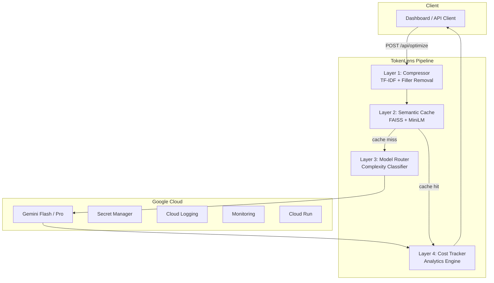

<!-- Badges -->
<p align="center">
  
  
  
  
  
  
  
</p>

<h1 align="center">🔬 TokenLens</h1>

<p align="center">
  <strong>Production-grade LLM middleware that reduces token cost by 30–60%</strong><br/>
  <em>Compress → Cache → Route → Track</em>
</p>

## 🚀 Live Demo: https://tokenlens-bddi.onrender.com

---

## 🚨 The Problem

LLM applications today are:
- 💸 Expensive (token costs scale fast)
- 🐌 Inefficient (redundant prompts, repeated queries)
- 🎯 Overkill (high-end models used for trivial tasks)

Most systems **blindly send raw prompts to expensive models**.

---

## 💡 The Solution: TokenLens

TokenLens is an **intelligent optimization layer** that sits between your app and LLM APIs.

It reduces cost *without sacrificing output quality* using a **4-stage pipeline**:

> **Compression → Caching → Smart Routing → Cost Intelligence**

---

## 🏗️ Architecture



---

## ⚙️ Optimization Pipeline

| Layer                 | Technology           | Function                                | Impact             |
| --------------------- | -------------------- | --------------------------------------- | ------------------ |
| **1. Compression**    | TF-IDF + tiktoken    | Removes filler, keeps high-value tokens | 25–40% reduction   |
| **2. Semantic Cache** | FAISS + MiniLM       | Reuses responses via similarity ≥0.92   | Up to 100% savings |
| **3. Model Router**   | Heuristic classifier | Routes to Flash vs Pro                  | 10–17× cheaper     |
| **4. Cost Tracker**   | JSON + analytics     | Tracks token usage & savings            | Full visibility    |

---

## 📊 Real Performance

| Use Case        | Tokens Before | After | Savings  |
| --------------- | ------------- | ----- | -------- |
| Verbose prompts | 180           | 108   | **40%**  |
| Code analysis   | 250           | 175   | **30%**  |
| Simple queries  | 12            | 12    | **0%**   |
| Cached queries  | 150           | 0     | **100%** |

---

## ⚡ Quick Start

### 🐳 Docker (Recommended)

```bash
docker build -t tokenlens .

docker run -p 8080:8080 \
  -e GEMINI_API_KEY=your-key \
  -e TOKEN_LENS_API_KEY=your-auth-key \
  tokenlens
```

Access:

* Dashboard → [http://localhost:8080](http://localhost:8080)
* API Docs → [http://localhost:8080/docs](http://localhost:8080/docs)

---

### 💻 Local Development

```bash
# Backend
pip install -r requirements.txt
GEMINI_API_KEY=your-key \
uvicorn backend.main:app --reload --port 8080

# Frontend
cd frontend
npm install
npm run dev
```

---

## 📡 API Overview

| Endpoint        | Method | Description                |
| --------------- | ------ | -------------------------- |
| `/api/optimize` | POST   | Full optimization pipeline |
| `/api/chat`     | POST   | Chat interface             |
| `/api/stats`    | GET    | Global metrics             |
| `/api/history`  | GET    | Request logs               |
| `/api/health`   | GET    | Health check               |
| `/docs`         | GET    | Swagger UI                 |

---

### 🔁 Example Request

```bash
curl -X POST https://tokenlens-bddi.onrender.com/api/optimize \
  -H "Content-Type: application/json" \
  -H "X-API-Key: your-auth-key" \
  -d '{
    "prompt": "Explain machine learning in simple terms",
    "session_id": "demo-001"
  }'
```

---

### 📦 Example Response

```json
{
  "original_tokens": 25,
  "compressed_tokens": 18,
  "compression_ratio": 0.72,
  "cache_hit": false,
  "model_used": "gemini-1.5-flash",
  "complexity_tier": "SIMPLE",
  "estimated_cost": 0.00000135,
  "cost_saved": 0.00009375,
  "efficiency_score": 28.0
}
```

---

## ☁️ Deployment (Google Cloud)

### Setup

```bash
gcloud auth login
gcloud config set project YOUR_PROJECT_ID
```

Enable services:

```bash
gcloud services enable \
  run.googleapis.com \
  cloudbuild.googleapis.com \
  secretmanager.googleapis.com \
  artifactregistry.googleapis.com
```

---

### Deploy

```bash
gcloud run deploy tokenlens \
  --source . \
  --region us-central1 \
  --allow-unauthenticated \
  --memory 2Gi \
  --cpu 2
```

---

## 🧪 Testing

```bash
pytest --cov=backend --cov-report=term-missing -v
```

---

## 🔒 Security

* API key authentication (`X-API-Key`)
* Rate limiting (60 req/min)
* Input validation + XSS filtering
* Secret Manager integration
* No secrets in code
* Non-root Docker runtime

---

## 📁 Project Structure

```
tokenlens/
├── backend/
├── frontend/
├── Dockerfile
├── cloudbuild.yaml
├── requirements.txt
└── README.md
```

---

## 🎯 Why This Matters

TokenLens is not just optimization — it’s **LLM cost governance**.

It enables:

* Scalable AI systems
* Production-grade efficiency
* Intelligent model usage

---

## 📄 License

MIT License

---

<p align="center">
  Built for real-world AI systems · Designed for scale 🚀
</p>
